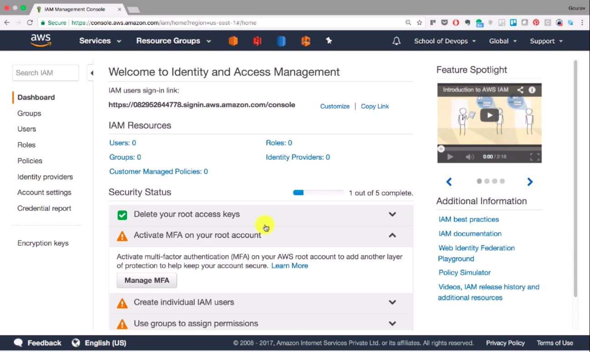
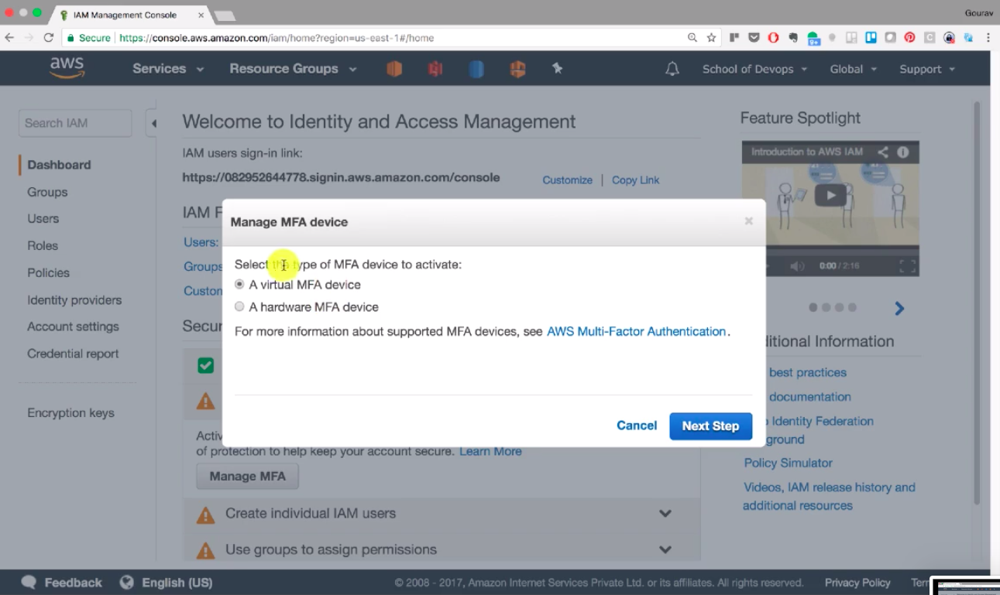

## Activate Multi Factor Authentication

To provide additional security to the aws account we can provision multi factor authentication. MFA is a nothing but a device which gives us the authentication keys in additional with login.

### How to activate MFA

Login to AWS account using Credentials
Go to IAM section
Click on activate MFA on Root Account

Then select the Type of MFA Device
1. A Virtual MFA Device (Recommended)
2. A hardware MFA Device

Install Google Authenticator on you Device

Scan the QR Code

Add the MFA Code and Confirm It.
You successfully added MFA Device.
